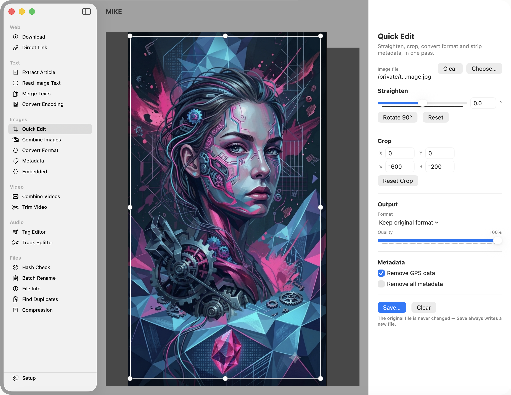

# MIKE – Mike's Toolbox


A small macOS toolbox for everyday media chores. Twenty-one independent sections, picked from the sidebar:

- **Download** – fetches a video with `yt-dlp` and picks the right settings by site: YouTube and unknown hosts are re-encoded to H.264/AAC so they play in QuickTime and iMessage, TikTok and Instagram are only rewrapped and keep their original quality. Live progress, and the download folder is remembered. An "Audio only" switch extracts just the audio track (MP3, M4A, AAC, OPUS, FLAC, WAV or OGG). By default both video and audio downloads take whatever quality yt-dlp considers best; unchecking "Best available quality" asks the source what it actually offers for that specific URL and lets you pick a genuine resolution or bitrate from the real list — MIKE never invents a number the source can't back up.
- **Direct Link** – turns a TikTok page URL into a direct link to the video file, copied to the clipboard straight away. Needs no external tools.
- **Extract Article** – pulls the readable text out of a web page, without ads, navigation or "you might also like" boxes, as plain text or Markdown. The page is rendered in an invisible WebKit view, so sites that build their content with JavaScript work too. The result can be edited before you copy or save it.
- **Read Image Text** – recognizes text in a photo, scan or screenshot with on-device text recognition (Apple's Vision framework) — no external tools, always available. Pick one or several image files, drag them in, or paste an image straight from the clipboard. Paragraph and line structure is reconstructed from where the text sits on the page; a batch of files is merged into one result with each file's name as a heading. The recognized text can be corrected before it is copied or saved as plain text, Markdown (recognized bullet lines become `-`) or RTF (paragraph structure only — Vision does not report bold or italic).
- **Merge Texts** – combines several text files (TXT, MD, RTF, CSV, LOG, or plain text with no extension) into one, in whatever order you put them in. Each file's name can be inserted as a heading, and the separator between sections is a free-text field — the default is a blank line, and leaving it empty runs sections straight into each other with no gap. A file that cannot be read as text is skipped and reported, the rest are merged anyway. The combined text can be corrected before it is saved as TXT or Markdown.
- **Convert Encoding** – reads a text file with one character encoding and writes it back out with another, leaving the original untouched. Foundation's automatic detection suggests a starting point, and both the source and target encoding can be overridden from a picker covering nine common encodings up top (UTF-8, UTF-16, Latin-1, ISO-8859-15, Windows-1252, CP850, Shift-JIS, GB2312, KOI8-R) and every other encoding the system supports below. A live preview shows the decoded text, so a wrong source encoding shows up immediately as broken characters. If the target encoding cannot represent every character, MIKE reports exactly how many rather than silently replacing them with `?`.
- **Quick Edit** – straightens, crops, converts format and strips metadata in one pass, for JPEG, PNG, TIFF, HEIC, HEIF, WEBP and BMP. The crop frame has draggable handles and stays in sync with numeric X/Y/W/H fields either way, rotation is a −45°...+45° slider (plus a 90° button for quarter turns) that live-updates the canvas, and empty corners exposed by rotation are filled white — visible on the canvas before you save. The original file is never touched; Save always writes a new file, at up to the original resolution regardless of the lower-resolution preview shown while editing.
- **Combine Images** – joins JPEGs and PNGs into a single image, either stacked into a tall one or lined up into a wide one. When the sources are not all the same size you choose what happens: scale them all down to the smallest, or keep the sizes and either fill the leftover space with white (written as JPEG) or leave it transparent (written as PNG) — each of those with the smaller images against the edge or centred. Point it at a folder, or pick files individually and drag them into the order you want.
- **Convert Format** – converts images between JPEG, PNG, WEBP, TIFF, BMP and GIF, as losslessly as each format allows; HEIC and HEIF read as well, though never as a target. Transparency is kept where the format supports it and flattened onto white where it does not. A Single File / Batch switch adds a whole-folder mode: pick a folder and a source format, and only the matching files are listed and converted — the count updates live as the source format changes. JPEG output gets an adjustable quality slider (batch only; single-file stays at maximum quality, as before). Cancelling a batch keeps every file already converted; originals are never touched.
- **Metadata** – lists the EXIF, GPS, TIFF and IPTC metadata in an image, with GPS shown as readable coordinates rather than raw values. Reading works on its own; with `exiftool` installed it can also set common fields (copyright, artist, description, capture date, GPS) and remove metadata — everything, or GPS alone. The unedited original is always kept alongside as a `_original` file.
- **Embedded** – complements Metadata by showing the embedded text blocks it does not: PNG text chunks (`tEXt`, `zTXt`, `iTXt`), XMP packets in WebP/TIFF/JPEG, and other blocks outside the EXIF group. Recognised AI-generation fields (AUTOMATIC1111 `parameters`, ComfyUI `prompt`/`workflow`) are grouped and highlighted, JSON values are shown indented with a character and token count, and XMP appears as a structured tree. PNG chunks are read directly from the binary, so viewing works without any tool; editing, adding and removing entries needs `exiftool`. The same `_original` protection applies.
- **Combine Videos** – joins MP4s without re-encoding. Mismatched files are detected up front and named, because ffmpeg would otherwise report success and hand back a file with broken timing or audio.
- **Trim Video** – cuts a clip out of MP4, MOV, MKV, M4V, AVI, WMV or FLV without re-encoding. A preview with a draggable green start marker and red end marker sits above editable `HH:MM:SS.s` fields — drag or type, both stay in sync. Formats AVFoundation cannot preview (AVI, for instance) show a note instead of a blank player; trimming itself still works since it goes through ffmpeg, not the preview.
- **Tag Editor** – reads and writes title, artist, album, year, track number, genre, comment and cover art, losslessly (`ffmpeg -c copy`). Empty fields are left alone, so only what you actually fill in gets written. The file is overwritten directly — safely: ffmpeg refuses to edit a file in place, so MIKE writes to a temporary file next to it and only swaps it in once ffmpeg has actually succeeded, leaving the original exactly as it was on any failure. Cover art is fully supported for MP3, FLAC and M4A; OGG, Opus, WAV and raw AAC have real gaps in what ffmpeg can do with them — see Known limitations.
- **Track Splitter** – splits one long recording into several tracks at the silences between them, without re-encoding. Analyze first (threshold and minimum duration are both adjustable, and can be re-run as often as needed before splitting), name the tracks — typing a pattern like `Albumname_%n` fills in the whole list at once, and any name can still be overridden by hand — then split. Cancelling keeps whatever tracks already finished.
- **Hash Check** – computes MD5, SHA-1, SHA-256 and SHA-512 for a file, streamed so even very large files work, and checks the result against an expected value pasted in (case and whitespace are ignored). Needs no external tools.
- **Batch Rename** – renames a batch of files through up to six chainable steps, in a fixed order: name from EXIF capture date, prefix, suffix, find & replace, case conversion, and space replacement. A live preview shows every resulting name before anything happens, and a name that would collide with another is flagged in red and blocks the rename until resolved.
- **File Info** – shows a file's size, MIME type, creation/modification/access dates, POSIX permissions and owner, Finder tags, comment and "where from" origin, and every extended attribute (xattr) it carries. The one xattr it can remove is `com.apple.quarantine` — the flag that blocks a downloaded file from opening — everything else here is read-only.
- **Find Duplicates** – scans one or more folders for byte-identical files (size first, then a SHA-256 hash of only the files that still match), groups them, and defaults to keeping the oldest copy in each group while suggesting the rest for the trash. Nothing is deleted without a final confirmation showing exactly how much space would be freed.
- **Compression** – unpacks and creates ZIP and TAR.GZ archives, and converts between the two formats (unpack, then repack) as a background pipeline that keeps the UI responsive. Reading a password-protected archive is detected and reported clearly rather than failing obscurely; RAR is not supported in any direction, since neither of the libraries MIKE uses implements it. Needs no external tools.
- **Setup** – shows where the external tools were found, with version and path, and helps install what is missing. Not one of Mike's tools itself, which is why it sits apart at the bottom of the sidebar.

Output files are never overwritten: a second run writes `combined (2).jpg` rather than replacing the first.



## Requirements

- macOS 13 (Ventura) or newer
- Apple Silicon
- `yt-dlp` and `ffmpeg` for the Download, Combine Videos and Trim Video sections, `cwebp` for WebP export, `exiftool` for editing and removing metadata — see below

## External tools

MIKE does **not** bundle `yt-dlp`, `ffmpeg`, `cwebp` or `exiftool`. yt-dlp breaks whenever a site changes and has to stay current through your package manager, and every bundled executable would have to be signed and notarized along with the app.

```sh
brew install yt-dlp ffmpeg webp exiftool
```

The Setup section shows the status of each one and offers to copy that command. It also checks whether Homebrew itself is present — if it is not, it offers Homebrew's official installer from brew.sh first, since the line above would otherwise fail. If you would rather not use Homebrew, each tool is also available as a standalone binary — download it, put it anywhere, and enter its full path in Setup.

MIKE looks for them in `/opt/homebrew/bin`, `/usr/local/bin` and `/usr/bin`, plus any path you enter yourself, which takes precedence. A tool only counts once it actually runs, so a quarantined or wrong-architecture download is reported rather than silently accepted. The check repeats whenever the window comes back to the front, so installing a tool while MIKE is open works without a restart.

Sections whose tools are missing are disabled up front and point at Setup — nothing fails only after you press a button.

## Installation

Grab the latest build from the [Releases](../../releases) page, unzip it and move `MIKE.app` to your Applications folder.

The app is not notarized, so macOS will refuse to open it on first launch. Go to **System Settings → Privacy & Security**, scroll down to the message about MIKE and click **Open Anyway**.

## Languages

The interface is available in **English**, **German** and **Spanish**, selected automatically from the system language. Unsupported languages fall back to English.

To try a language without changing your system settings, launch the binary directly:

```sh
MIKE.app/Contents/MacOS/MIKE -AppleLanguages '(es)'
```

## Known limitations

- **Paywalls:** Extract Article only sees what the server delivers without a login. On a paywalled page you get the freely served part and nothing more.
- **Article extraction is a best guess.** Readability finds the main content on ordinary article pages; overview pages, forums and heavily interactive sites may yield little or nothing. Pages that load their content slowly can need more than the 1.5 s MIKE waits after the page reports itself finished.
- **Joining videos needs matching files.** The concat step copies streams instead of re-encoding, so codec, resolution, frame rate and audio layout have to agree. MIKE checks this and refuses rather than producing a broken file, but it cannot fix the mismatch for you.
- **WebP export needs `cwebp`.** macOS can read WebP but not write it, and Homebrew's stock ffmpeg is built without libwebp. WEBP stays visible in the format list and is disabled with an explanation when no encoder is available.
- **Editing metadata needs `exiftool`.** Reading works through the system on its own, so the Metadata section always lists what an image contains; the edit and remove controls are disabled with a pointer to Setup until exiftool is installed. On the first edit or removal the untouched original is saved next to the file as `<name>.<ext>_original`. If such a backup already exists from an earlier run it is **kept**, not overwritten — MIKE says so and writes the change in place, so the real original is never lost on a second pass.
- **JPEG chroma subsampling is not controllable.** ImageIO exposes quality but not subsampling, so JPEG output is written at maximum quality with whatever subsampling the system picks.
- **Intel is untested.** The build is universal and will most likely run on Intel Macs with macOS 13 as well, but it is only tested and supported on Apple Silicon.
- **Combine Images sorts by name.** Files are ordered the way the Finder orders them. If you need a different sequence, switch the source to Files and drag them into place.
- **Read Image Text assumes a single reading column.** Text is read top to bottom as one column; Vision reports no column or table structure, so a genuinely multi-column layout (a newspaper page, a two-column form) can come out in the wrong order. Line breaks are kept as they appear on the page rather than rejoined into flowing prose, which suits screenshots, receipts and signs better than scanned book pages.
- **Cover art in Tag Editor is real, not universal.** MP3, FLAC and M4A embed and remove cover art fully. OGG and Opus do not: the standard way to tag a cover on those (`METADATA_BLOCK_PICTURE`) is silently dropped by ffmpeg's own muxer on write — confirmed directly, not assumed — so cover art is disabled for both, though their text tags work fully. WAV's muxer refuses a cover outright, and raw AAC (`.aac`) files carry no metadata container of any kind, so nothing — tags or cover — can be read or written for them. WAV also has no way to store Album Artist; every other field works.
- **Track Splitter treats edge silence as padding.** Silence in the first or last two seconds of the file never becomes a track boundary, on the assumption that an album-side or cassette rip almost always has a little dead air at each end. Every other detected silence becomes a cut, with no attempt to trim silence from inside a track.
- **Convert Format's batch mode scans one folder level only.** Files in subfolders are not picked up, and a file that fails to convert (unreadable, corrupt) is skipped and named at the end rather than stopping the whole batch. Batch cancellation takes effect between files, not mid-file — nothing partial is ever left behind, since each output file is written whole or not at all.
- **Convert Format strips EXIF/GPS metadata as a side effect.** Unlike Quick Edit, Convert Format does not carry the source's metadata into its output, so every converted file comes out with none at all, regardless of what you intended to keep. Nothing in the UI currently mentions this.

## Building

Requires Xcode 15 or newer.

The Xcode project is generated from `project.yml` with [XcodeGen](https://github.com/yonaskolb/XcodeGen), but the generated project is checked in as well:

```sh
open MIKE.xcodeproj
```

Then build and run in Xcode (⌘R). After changing `project.yml`:

```sh
brew install xcodegen   # if not already installed
xcodegen generate
```

The app is not sandboxed — required for launching the external tools and for writing to folders you pick.

## Support

MIKE is free and always will be. If it saved you some hassle, you can [buy me a coffee](https://ko-fi.com/neonrost).

## License

Copyright (C) 2026 NeonRost

This program is free software, released under the **GNU General Public License, version 3** (or, at your option, any later version). See the [LICENSE](LICENSE) file for details.

MIKE bundles **Readability.js** (Copyright (c) 2010 Arc90 Inc), used by Extract Article, which is licensed under the **Apache License 2.0**. Its full text is in [LICENSE-Readability](LICENSE-Readability), and both licenses are also readable inside the app under **MIKE → About MIKE → Show License**.
